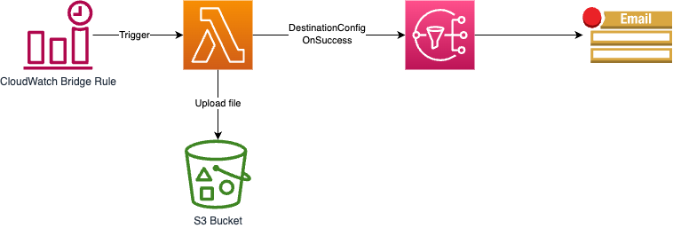

CloudWatch Event(Bridge) + Lambda + SNS Topic + Email Notification

This repo is a simple event & notification workflow example that deployed in AWS Cloud. It's a totally AWS Cloud native workflow, and all AWS resources are defined and deployed using Terraform.
___

The repo code implements below scenario:

Extract AWS available services by specific regions from AWS official API using AWS Lambda function, then upload the findings to S3 bucket, finally send out a email notification to subscribers with the presigned url of findings file in S3 bucket. The entire workflow is triggered as scheduled using CloudWatch Event (Bridge).

Below is the workflow diagram. The core functionality is defined in Lambda function, including extract data, upload file to S3 bucket, generate pre-signed url, etc. You can create your own workflow following the example, only need to change the Lambda function core code as you need. CloudWatch scheduled rule cron expression and email notification address can be configured in *variables.tf*. 




## Code Structure
```bash
.
├── Pipfile                         # pipenv file to save dependencies
├── Pipfile.lock
├── README.md
├── cloudformation                  # The AWS resources' CloudFormation to save terrafrom state file and lock file
│   └── tf_infrastructure.yaml
├── extract-services-by-region      # Lambda function source code and requirements.txt
│   ├── main.py
│   └── requirements.txt
├── main.tf                         # main.tf, outputs.tf, variables.tf are all Terrform related definitions
├── makefile                        # A makefile to make command life easily
├── outputs.tf
└── variables.tf
```
Notes:
- tf_infrastructure.yaml: Terrform use S3 bucket and Dynamodb table to save state and lock files. That is why I create a CloudFormation template here. You can create these resources manually from AWS console as well. Then update `bucket` and `key` field in below block in *main.tf*.
```yaml
  backend "s3" {
    bucket  = "tf-state-210692783429-cn-north-1"
    key     = "extract-services-by-region.json"
  }
```
- All AWS resources are defined in `main.tf`.
- Always remember to add denpendencies in `requirements.txt` if you are sure that is necessary for Lambda function.
- After deployment, you will receive an email from `AWS Notification - Subscription Confirmation`. Comfirm the subscription so you can receive email notification later.

## Local Development
In order to debug and test your Lambda code locally, firstly you should create a vitual environment for it. In the example, we use _python_ as the language, so I chose *conda* to setup a vitual environment and install python dependencies in it. Run below command.
```bash
# Create a virtual environment
conda create -n extract-aws-services-by-region python=3.9
# Activate the environment
conda activate extract-aws-services-by-region
# Install dependencies in environment
pip install -r requirements-dev.txt
# Or run below command
make install
```
## Deployment

### Deploy from Local
Deploy the application to AWS using terraform CLI

```bash
make init

make plan

make apply
```

Once Terraform creates the function, invoke it using the AWS CLI.

Option 1

```bash
# Invoke lambda function synchronously (and wait for the response) using below command. It won't trigger the downstream SNS topic as the Lambda destination configuratio is for Asynchronous invocation.

export AWS_PROFILE=210692783429_UserFull

aws lambda invoke \
    --function-name=$(terraform output -raw function_name) \
    response.json

# Then, download the xlsx file by click on the presigned URL that print out using below command.
```
```bash
cat response.json | jq .body
```
Option 2

If you want to test the entire workflow, run below command to sent asynchronous invocation. An email notification will send to the subscribers.

```bash
export AWS_PROFILE=210692783429_UserFull

aws lambda invoke \
    --function-name $(terraform output -raw function_name) \
    --invocation-type Event \
    --payload "{}" \
    response.json
```

# Deploy via GitHub Actions

I create a `deploy.yaml` GitHub Actions workflow to deploy the whole infrastructure to AWS automatically. Send the pipeline result in `Actions` tab from GitHub repo.

## Reference
https://developer.hashicorp.com/terraform/tutorials/aws/lambda-api-gateway#lambda-api-gateway
